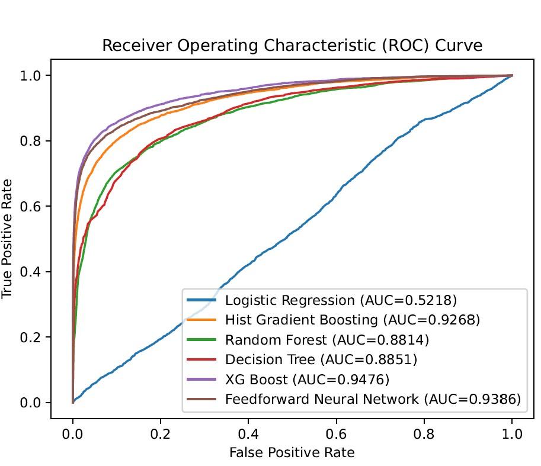

# Applied Machine Learning Project Deliverable Report

Fraudulent Transaction Detection (Group 19) 

Team Members (Name, UNI at Columbia)
- Haozhong Jia, hj2622; 
- Nikhil Balwani, nb3096;
- Qingcheng Yu, qy2281;
- Zain Merchant, ztm2105;

# aml-4995-group-19
AML COMS 4995 group 19 project
<!-- TABLE OF CONTENTS -->
## Table of Contents

- [Fraudulent-Transaction-Detection](#fraudulent-transaction-detection)
  - [Table of Contents](#table-of-contents)
  - [About the Project](#about-the-project)
    - [Overview](#overview)
  - [Built With](#built-with)
    - [Problem Statement](#problem-statement)
    - [Data Source](#data-source)
    - [Plan](#plan)
  - [Approach](#approach)
    - [Data Preprocessing](#data-preprocessing)
    - [Learning Algorithms](#learning-algorithms)
  - [Results](#results)
## About the Project

Photo by <a href="https://unsplash.com/@michael_walker?utm_source=unsplash&amp;utm_medium=referral&amp;utm_content=creditCopyText">Michael Walter</a> on <a href="https://unsplash.com/photos/3C0SWyusdS8?utm_source=unsplash&amp;utm_medium=referral&amp;utm_content=creditCopyText">Unsplash</a>

### Overview

* Fraudulent transactions have a significant impact on businesses and consumers alike, and developing an effective fraud detection system is essential for minimizing financial losses and maintaining trust in digital payment systems.
* The goal of this project is to create an efficient binary classification model that can detect fraudulent transactions in the IEEE-CIS Fraud Detection dataset.
* By implementing various machine learning algorithms and techniques, this project will explore the most effective ways to identify and predict fraud, ultimately providing a valuable tool for businesses and financial institutions to better protect their users.

## Built With

* [Python](https://www.python.org/)
* [Jupyter Notebook](https://jupyter.org/)
* [Google Colab](https://colab.research.google.com/)

### Problem Statement

* The primary objective of this project is to create a binary classification model that can accurately detect whether a given transaction is fraudulent or not. The model will be trained and tested using the IEEE-CIS Fraud Detection dataset.

### Data Source

* The IEEE-CIS Fraud Detection dataset is provided by Vesta Corporation from Kaggle, those data come from Vesta's real-world e-commerce transactions.
* The dataset is divided into two parts: identity and transaction. These two types of data are joined by the unique feature 'TransactionID', which represents a unique timedelta from a given reference datetime.
* The identity data contains features about identification information, network connection information, and digital signatures associated with transactions. 
* The transaction data contains features about money transfers and other consumption services, providing information about the purchase of goods, as well as information about the seller.
* The dataset contains a total of 871 columns.
* Due to security and privacy concerns, all features are masked and represented by numerical IDs, except for device types and device systems.

### Plan

* Exploratory Data Analysis (EDA): Analyze the preprocessed dataset to identify trends, patterns, and correlations that may be useful in building the model.
* Model Selection: Experiment with various machine learning algorithms, such as logistic regression, random forests, gradient boosting machines and neural network, to identify the most suitable model for the problem.
* Model Training: Train the selected model using the preprocessed dataset, applying techniques like cross-validation and hyperparameter tuning to optimize its performance.
* Model Evaluation: Assess the performance of the trained model using appropriate evaluation metrics, such as precision, recall, F1 score, and AUC-ROC curve.

## Approach
### Data Preprocessing

* Check the missing value rate for each of the features in the dataset, and drop the features with higher than 70% missing data which not provide enough information
* Separated these categorical variables and numerical variables from the dataset, filled in numerical values with median values
* Drop highly correlated (> 0.9) features to reduce redundant information for model training
* Split the dataset into a development set and a test set in the ratio of 4:1 by using stratified splitting (because the dataset is imbalanced).
* Implemented StandardScaler for numerical features, one-hot encoding for categorical features, and target encoding for high cardinality categorical features. 
* Resampling development dataset by using SMOTE to create a balanced dataset that classes have the same size of samples.

### Learning Algorithms

* Decision Tree
* Random Forest
* Hist Gradient Boosting
* XGBoosting
* Neural Network
* Logistic Regression

## Results

